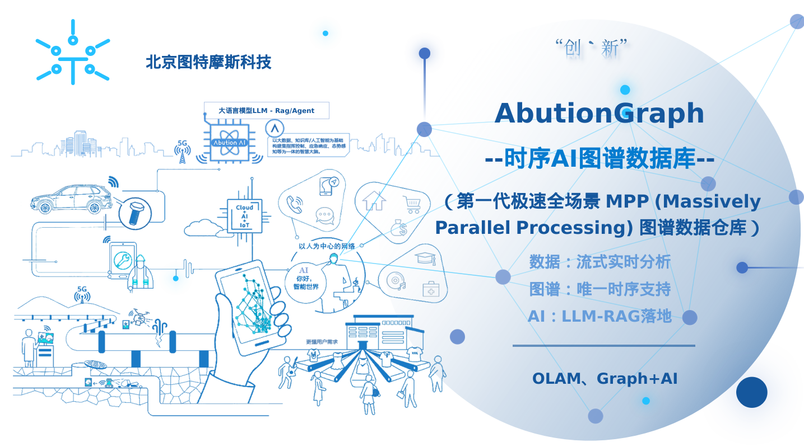
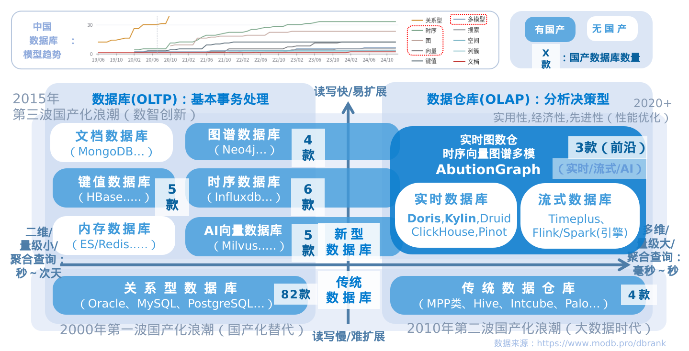
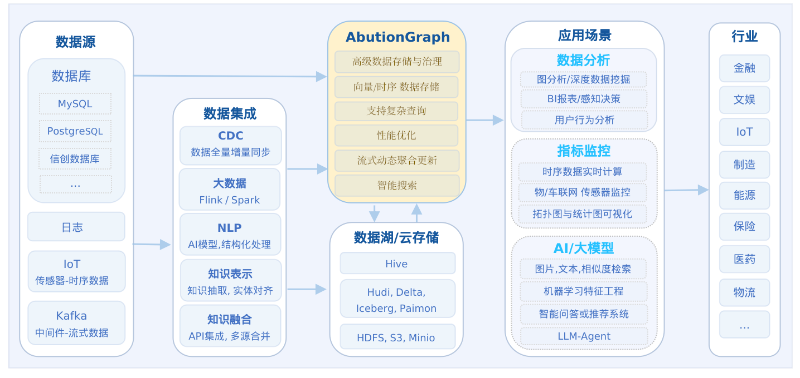

# AbutionGraph（本体数据库/时序图谱）

> AbutionGraph是第一款极速全场景MPP多模实时图数据仓库，也是首款真正意义上实现**本体论（Ontology）概念**以及**时序图谱能力**的数据库产品。<br>
&emsp;&emsp;面向**本体建模**，创新支持**T（类型）、P（谓词）、F（函数）、Agg（聚合）、Action（行动）**五位一体的本体论编程范式，实现属性、关系、规则、行为的统一建模与链式查询。面向**时序分析**，独创具有时序图计算分析的能力。面向**AIGC**，创新支持知识向量的相似度检索。面向**国产信创**，图标签等全面中文支持与各种国产环境兼容。面向**用户**，便捷的安装、易于使用的API、极速的性能、轻量运维的架构-可单体或存算分离、更多有用的特色功能-行级权限子图隔离/明细与聚合模型/图向量/时序图/CDC全量增量同步/自定义节点/MinMaxSumHll等几十种聚合方法。<br>
&emsp;&emsp;向时序多维关联数据流式分析（OLAM/OLAP）的知识图谱数据库，它融合了**RDF图谱+属性图谱+时序计算+数仓多维标签**等多种数据库的优点，除传统图谱数据存储外，Abution的目标是以足够低的延迟（亚秒级）来服务大规模图谱数据（达BP级）的实时决策分析，而非只是简单实时用户查询。Abution能针对大规模时序数据流自动端到端的聚合计算并立即更新存储，特别适用于指标系统建设、实时交互式数据分析、可视化大屏展现、IOT流式数据监测、拓扑数据动态行为计算、相同点边id的数据根据标签分类管理等等。



AbutionGraph具备多种数据库模型特性，除传统静态数据图谱模型外，具备动态时序图和向量图的能力来以足够低的延迟（亚秒级）服务大规模数据（达BP级）的实时决策分析。



AbutionGraph产品定位是一款**图数据仓库/时序图谱数据库**，同时也是**本体数据库**，（叫什么不重要，能力覆盖才是道理）图谱能力是第一公民，时序和向量作为图谱的“超能力”以弥补传统图数据库的短板，而**本体论（Ontology）**则是其核心思维框架：通过**类型（Type）、谓词（Predicate）、函数（Function）、聚合（Aggregate）、行动（Action）**的统一建模，实现从“数据存储”到“知识推理”的跨越。因其独创性，AbutionGraph使用场景可以涵盖：**本体数据库 ＋ 图谱数据库 ＋ 时序数据库 ＋ 向量数据库 ＋ 实时数据仓库**，特别适用于多技术交叉类场景，如AIGC、实时复杂查询分析、用户画像指标系统、关联图可视化大屏、IoT传感上下游联动数据监测、用户行为分析、高级数据分类治理等。

## AbutionGraph技术特性：
> 分布式企业级图数据库，提供图数据的实时-存储、查询和OLAP分析能力，主要面向对**局部数据**的海量并发查询和**全量数据**的实时在线计算/更新/监控。<br>
> 用于大数据量高吞吐率和低延迟的同时，实时反馈数据态势变化（异常）情况，保障决策分析业务7*24小时在线运行。

| 支持功能 | AbutionGraph | Neo4j | TigerGraph |
| :--: | :--: | :--: | :--: |  
| 分布式/高可用/高容错 | √ | X | √ |  
| RDF图模型 | √ | X | X |  
| 属性图模型 | √ | √ | √ |  
| **本体论建模（T/P/F/Agg/Action）** | √ | X | X |  
| **五位一体编程范式** | √ | X | X |  
| **自定义谓词函数（PredictFunction）** | √ | X | X |  
| **自定义转换函数（TransformFunction）** | √ | X | X |  
| **自定义聚合函数（AggregateFunction）** | √ | X | X |  
| **行动函数（ActionFunction + LLM集成）** | √ | X | X |  
| **Code动态函数（运行时编译加载）** | √ | X | X |  
| **函数内嵌套图查询** | √ | X | X |  
| （少量/万级内批量/部分数据）实时增删查改-低性能/吞吐 | √ | √ | √ |  
| （大量/千万级批量/实时数据）实时增删查改-高性能/吞吐 | √ | X | X |  
| CDC增量同步技术，第三方数据库实时同步 | √ | X | X | （图表同步） |
| TB级大容量 | √ | √ | √ |  
| 支持数据不区分实体表/关系表和不分先后的混合入库 | √ | X | X |  
| 支持任意数据删除操作（独立点/边存储） | √ | X | X | （高实用性）|
| 点边检索、全文检索 | √ | √ | √ |  
| 对接流式数据源、关系型数据源 | √ | √ | √ |  
| 图分析算法（机器学习） | √ | √ | √ |  
| 图分析算法（时序流式） | √ | X | X | （高效性）|
| 图谱可视化工具 | √ | √ | √ |  
| 读写任务内高效并行存储 | √ | √ | √ |  
| 在线/离线、全量/增量的备份恢复 | √ | √ | √ |  
| 多图谱存储 | √ | √ | √ |  
| MPP并行资源设置 | √ | X | X |  
| 分布式图实例 | √ | X | X |  
| 对接OWL等知识推理（无中生有）工具 | √ | X | X |  
| 自定义函数和算法，扩展语法功能 | √ | X | X |  
|   | - | - | - |  
支持大吞吐（全量/全图）流式的存储/计算/更新，实时流式数据库能力 | √ | X | X | （时序图谱能力）|
支持数据保留策略，自动删除过期数据 | √ | X | X |  
支持自定义业务公式/函数作为实体关系数据自动计算和自动合并更新的规则 | √ | X | X | （动态图谱）|
支持全图毫秒级**时间范围/聚合查询**、三层以上路径聚合过滤遍历（如平均值、最大值、最小值等） | √ | X | X | （高业务适配性）|
支持知识补全，动态新增/隐藏/更新最新字段 | √ | X | X |  
支持插件第三方集成，如 Grafana | √ | X | X |  
支持自定义警报，支持基于规则的警报触发 | √ | X | X |  
支持作为AI算法指标特征工程库，实时更新模型指标，实时取用 | √ | X | X |  
支持对接流式中间件及ETL系统，Kafka、Flink、Spark、定制任意数据源等 | √ | X | X | （大数据生态）|
|   | - | - | - |  
支持文本/音视频/实体/关系等信息的Embedding向量数据存储/相似度检索 | √ | X | X | （向量数据库能力）|
支持向量数据存储在实体/关系上及设置自动图向量合并规则 | √ | X | X | （向量图谱）|				
作为图数据库的一种实体/关系的高效模糊检索能力 | √ | X | X |  
支持**HybridRAG：VectorRAG+GraphRAG**的一体化高效方案 | √ | X | X | （LLM落地最佳方案）|
|   | - | - | - |  
| 内置用户管理和元数据管理工具，进行用户间“每张图谱级别”的数据隔离管理 -低权限 | √ | X | X |  
| **支持子图隔离**-不同用户对同一图谱的每一条数据隐藏与可见（原子级别） -高权限 | √ | X | X | （业务安全性）|
| 共享数据访问权限，与别人的数据发生关联并可见可查询 | √ | X | X | （数据安全性）|
| 图数据库专家支持服务 | √ | X | X |  

AbutionGraph支持 AbutionQL、Gremlin、Cypher、GraphQL、SparQL 查询语法，并支持与Java进行混合编程开发和PythonAPI。<br>
AbutionGraph采用存算分离架构，使用户可以轻松的将其部署对接到单机环境／分布式环境／云端环境，并实现集群规模动态扩容伸缩。

## **AbutionGraph使用场景：**
AbutionGraph是一款端到端数据实时分析的图谱数据库，实时(写入实时、决策分析实时、流式图计算实时)，数据源经过各种数据集成和加工处理后，入库到实时图数仓AbutionGraph和离线湖云中，
1. 基于历史数据构建的指标模型实时查询；
2. 接入流式数据并实时更新业务指标；
3. 实时查询历史和时序窗口聚合数据；
4. 实时执行决策行动。
Abution被广泛应用在以下场景：


如果您期望：好治理, 强分析, 高性能, 轻运维, 低延迟, 省资源　的任一解决方案，AbutionGraph都可以帮助到。
一些通用场景举例：
1. **本体论建模与推理**  
   希望将业务知识形式化为**类型（T）**、**谓词（P）**、**函数（F）**、**聚合（Agg）**、**行动（Action）**五位一体的统一模型，支持规则推理、行为触发和动态知识更新。
2. **交互式数据分析**  
   希望快速从大规模历史数据中得出统计分析报告用于决策，数据探索-秒内响应、年月日时间窗口分析-秒内响应等。
3. **流式数据监控**  
   希望从实时源源不断产生数据的iot/应用程序中立即反映趋势，态势感知、实时聚合计算、时序指标变化规律等。
4. **多维数据管理**  
   希望将同一个id-人身份证等，绑定上工商/税务/车房产/银行/通话等不同结构的数据，并通过设定标签识别类别数据，实现高效管理与查询。
5. **图谱关联计算**  
   希望导入的实体与关系自动实现关联，而不是明确“点表/边表”必须一一具备，允许孤立点。此外，希望自动汇总一跳邻居节点信息如：出度入度、基数统计、百分位数等，实现复杂关联指标的即席查询。
6. **子图隔离**  
   希望在一个图谱中实现不同用户导入的数据仅自己可见，或授权可见，很适用于公安、政府、跨部门、多用户协作等场景。
7. **文本/图像/音视频/Embedding存储-图向量计算**  
   希望在图谱中存储Voctor数据。混合搜索：通过合并向量和关键字技术来改善“精准+模糊”的搜索体验；Graph RAG：使用私有数据构建值得信赖的生成式AI应用程序，并将隐私和安全放在首位，使用您最喜欢的LLM显示相关且准确的答案；全局知识类问答：新增数据(实体/关系) -> 局部节点聚合更新/全局摘要自动生成。
8. **Code动态函数**  
   希望在不重启服务的情况下动态加载和更新业务逻辑，支持CodeTransform/CodeAggregate/CodeAction函数的运行时编译与装载。
9. **函数内嵌图查询**  
   希望在聚合函数或行动函数内部执行嵌套的图查询，实现条件判断、上下文感知和动态回写的完整闭环。

## 状态
AbutionGraph当前（2026）版本为v3.6.0，已经过多年大量的生产应用。
服务器推荐：CentOS7或者Ubuntu18以上系统，不满足的话请升级系统gcc版本至8以上版本。
资源推荐：由4～8个CPU内核和8～32GB内存（分布式情况下，资源丰富可在单台机器上启动多个数据库实例提供系统并行性）。

## 快速上手体验
Abution的TmpGraph实例使用临时缓存持久化数据，无需安装部署即可体验大部分功能，程序执行完毕则释放空间，本意是方便开发者本地调试编写的程序。
TmpGraph推荐使用jdk8/11进行开发。此外，abution-jshell是系统封装的一个REPL启动命令，可以直接输入业务代码并查看其执行结果。
1. 导入开发包jar依赖到IDEA
2. 运行程序 GraphOfTheGodsFactory.java（如下）

### 一、本体建模（Ontology Modeling）
AbutionGraph的Schema由entity和edge组成，通过 **T（类型）**、**P（谓词）**、**F（函数）**、**Agg（聚合）**、**Action（行动）**、**Role（权限）** 六位一体构建完整的本体模型。

#### **1. 类型（T）定义**
```java
import cn.thutmose.abution.graph.T;
import cn.thutmose.abution.graph.type.frequency.FreqMap;
import cn.thutmose.abution.graph.type.cardinality.DistinctCountHllp;
import cn.thutmose.abution.graph.type.vector.VectorIndex;
import cn.thutmose.abution.graph.type.bm25.BM25Index;

Schema schema = Schema
    .entity(
        // 基础实体类型
        Dimension.label("V|Person", "人员")
            .property("name", T.String)
            .property("age", T.Integer)
            .property("tags", T.TreeSetString, "标签集合")
            .build(),
            
        // 聚合实体类型（带聚合函数）
        Dimension.label("V|PersonAgg", "人员聚合统计")
            .property("freq_friends", T.FreqMap, Agg.FreqMap(), "朋友频次统计")
            .property("distinct_locations", T.DistinctCountHllp, Agg.DistinctCountHllp(), "去重位置统计")
            .property("vector_profile", T.FloatArray, Agg.FloatArrayAdd(), "向量画像")
            .property("doc_index", T.BM25Index, Agg.BM25Index(), "文档索引")
            .groupBy("date")  // 按天聚合
            .build(),
            
        // 向量索引类型
        Dimension.label("V|VectorDoc", "向量文档")
            .property("content", T.String)
            .property("embedding", T.VectorIndex, Agg.VectorIndexMerge(), "向量索引")
            .property("bm25", T.BM25Index, Agg.BM25Index(), "BM25索引")
            .groupBy()
            .build()
    )
    .edge(
        // 基础关系类型
        Dimension.label("E|Friend", "朋友关系")
            .property("since", T.Date)
            .property("strength", T.Integer)
            .build(),
            
        // 聚合关系类型
        Dimension.label("E|FriendAgg", "朋友关系聚合")
            .property("total_interactions", T.Long, Agg.Sum())
            .property("interaction_dates", T.TimestampSet, Agg.TimestampSet())
            .groupBy()
            .build()
    )
    .build();
```

#### **2. 谓词（P）过滤**
```java
import cn.thutmose.abution.graph.P;

// 基础谓词过滤
graph.V().dim("V|Person")
    .has("age").by(P.MoreThan(18))
    .has("name").by(P.Contains("张"))
    .ToList().exec();

// 组合谓词
graph.V().dim("V|Person")
    .has("age").by(P.And(P.MoreThan(18), P.LessThan(60)))
    .has("tags").by(P.Contains("VIP"))
    .ToList().exec();

// 自定义谓词（PredictFunction）
public class IsAdult extends PredictFunction<Integer> {
    @Override
    public boolean test(Integer age) {
        return age != null && age >= 18;
    }
}

graph.V().dim("V|Person")
    .has("age").by(new IsAdult())
    .ToList().exec();
```

#### **3. 函数（F）转换**
```java
import cn.thutmose.abution.graph.F;

// 内置函数转换
graph.V().dim("V|Person")
    .transform("name").by(F.ToUpperCase()).as("name_upper")
    .transform("age").by(F.ItIncrement(1)).as("age_next_year")
    .ToList().exec();

// 自定义转换函数（TransformFunction）
public class ExtractDomain extends TransformFunction<String, String> {
    @Override
    public String apply(String email) {
        if (email == null || !email.contains("@")) return null;
        return email.substring(email.indexOf("@") + 1);
    }
}

graph.V().dim("V|Person")
    .transform("email").by(new ExtractDomain()).as("domain")
    .ToList().exec();
```

#### **4. 聚合（Agg）函数**
```java
import cn.thutmose.abution.graph.Agg;

// Schema中绑定聚合函数
Dimension.label("V|Metric", "指标维度")
    .property("count", T.Long, Agg.Sum())
    .property("max_value", T.Double, Agg.Max())
    .property("min_value", T.Double, Agg.Min())
    .property("avg_value", T.Double, Agg.Avg())
    .property("freq_tags", T.FreqMap, Agg.FreqMap())
    .property("distinct_users", T.DistinctCountHllp, Agg.DistinctCountHllp())
    .groupBy("date", "category")
    .build();

// 自定义聚合函数（AggregateFunction）
public class SumIfEven extends AggregateFunction<Integer> {
    @Override
    protected Integer _apply(Integer state, Integer input) {
        if (input == null) return state;
        if (input % 2 == 0) {
            return state + input;
        }
        return state;
    }
}

Dimension.label("V|CustomMetric", "自定义指标")
    .property("even_sum", T.Integer, new SumIfEven())
    .groupBy("date")
    .build();
```

#### **5. 行动（Action）函数**
```java
import cn.thutmose.abution.jfunc.function.ActionFunction;

// 行动函数定义（含条件判断与执行动作）
public class RiskDetectAction extends ActionFunction {
    
    @Override
    public boolean condition(Map<String, Object> input) {
        // 条件判断：交易金额超过阈值
        Integer amount = (Integer) input.get("amount");
        return amount != null && amount > 10000;
    }
    
    @Override
    public Void apply(Map<String, Object> input) {
        // 执行动作：创建风险告警实体
        String vertex = (String) input.get("vertex");
        Integer amount = (Integer) input.get("amount");
        
        Entity alert = Knowledge.labelV("V|RiskAlert")
            .vertex("alert_" + System.currentTimeMillis())
            .property("source", vertex)
            .property("amount", amount)
            .property("time", new Date())
            .property("level", "HIGH")
            .build();
        
        // 回写图数据库
        getGraph().addKnow(alert).exec();
        return null;
    }
}

// Schema中绑定行动函数
Dimension.label("V|Transaction", "交易记录")
    .property("vertex", T.String)
    .property("amount", T.Integer)
    .property("time", T.Date)
    .action(new RiskDetectAction(), "大额交易风险检测", "vertex", "amount")
    .build();
```

#### **6. Code动态函数（运行时编译加载）**
```java
// CodeTransformFunction 动态编译
CodeTransformFunction tf = new CodeTransformFunction(
    dependencies,  // 依赖类源码映射
    "demo.code.NameNormalizer",
    "package demo.code; public class NameNormalizer { public Object apply(Object input) { return input==null?null:input.toString().trim(); } }"
);
tf.loadFromSchemaConfig(schema);

// CodeAggregateFunction 动态编译
CodeAggregateFunction aggFn = new CodeAggregateFunction(
    List.of(),
    "demo.code.IntSumAggregator"
);
aggFn.loadFromSchemaConfig(schema);

// CodeActionFunction 动态编译
CodeActionFunction actionFn = new CodeActionFunction(
    List.of(),
    "demo.code.RiskTagAction"
);
actionFn.setSchema(schema);
actionFn.loadFromSchemaConfig(schema);
```

#### **7. 函数内嵌图查询**
```java
// 在行动函数中执行嵌套图查询
public class CommunityDetectAction extends ActionFunction {
    
    @Override
    public boolean condition(Map<String, Object> input) {
        return input.containsKey("vertex");
    }
    
    @Override
    public Void apply(Map<String, Object> input) {
        String vertex = (String) input.get("vertex");
        
        // 查询一跳邻居
        List<Object> neighbors = getGraph().V(vertex)
            .OutV()
            .ToList()
            .exec();
        
        // 查询边的共现关系
        List<Edge> edges = getGraph().V(vertex)
            .BothE()
            .label("E|Interaction")
            .ToList()
            .exec();
        
        // 根据邻居和边信息构建社区标签
        String community = detectCommunity(neighbors, edges);
        
        // 回写社区信息
        Entity entity = Knowledge.labelV("V|Person")
            .vertex(vertex)
            .property("community", community)
            .build();
        
        getGraph().addKnow(entity).exec();
        return null;
    }
}
```

### 二、传统静态图谱

**1）图谱建模**  
AbutionGraph的Schema由entity和edge组成，缺少任一项也是允许的。其中，维度标签都由Dimension类定义，label第二个参数为标签描述，可缺省；property的字段可以指定为任意类型，只要写入数据类型一致即可。
```java
Schema schema = Schema
    .entity(
        Dimension.label("V|Titan", "太阳神").property("age", Integer.class).build(),
        Dimension.label("V|God", "上帝").property("age", Integer.class).build(),
        Dimension.label("V|Demigod", "小神").property("age", Integer.class).build(),
        Dimension.label("V|Human", "人类").property("age", Integer.class).build(),
        Dimension.label("V|Monster", "怪物").build(),
        Dimension.label("V|Location", "场景").build()
    ).edge(
        Dimension.label("E|Father", "父亲").build(),
        Dimension.label("E|Brother", "兄弟").build(),
        Dimension.label("E|Mother", "母亲").build(),
        Dimension.label("E|Battled", "战争")
           .property("time", Integer.class)
           .property("place", Geoshape.class)
           .build(),
        Dimension.label("Egg|BattledAggregation", "战争统计")
           .property("totalTime", Integer.class, Agg.Sum())
           .groupBy()
           .build(),
        Dimension.label("E|Pet", "宠物").build(),
        Dimension.label("E|Lives", "生活").property("reason", String.class).build()
    ).build();
```

**2）创建图谱**
应用schema新建一个名叫"Gods"的图谱。
```java
Graph g = G.TmpGraph("Gods", schema);
```

**3）手动构建图谱数据**
1. 创建实体数据
```java
Entity saturn = Knowledge.dimV("V|Titan").vertex("saturn").property("age", 10000).build();
Entity sky = Knowledge.dimV("V|Location").vertex("sky").build();
Entity jupiter = Knowledge.dimV("V|God").vertex("jupiter").property("age", 5000).build();
Entity neptune = Knowledge.dimV("V|God").vertex("neptune").property("age", 4500).build();
Entity hercules = Knowledge.dimV("V|Demigod").vertex("hercules").property("age", 30).build();
...
```
2. 创建关系数据
```java
// jupiter relation
Edge eg = Knowledge.dimE("E|Father").edge("jupiter", "saturn", true).build();
Edge eg1 = Knowledge.dimE("E|Lives").edge("jupiter", "sky", true).property("reason", "loves fresh breezes").build();
Edge eg2 = Knowledge.dimE("E|Brother").edge("jupiter", "neptune", true).build();
//hercules relation
Edge eg7 = Knowledge.dimE("E|Father").edge("hercules", "jupiter", true).build();
Edge eg8 = Knowledge.dimE("E|Mother").edge("hercules", "alcmene", true).build();
Edge eg9 = Knowledge.dimE("E|Battled").edge("hercules", "nemean", true).property("time", 1).property("place", Geoshape.point(38.1, 23.7)).build();
Edge eg10 = Knowledge.dimE("E|Battled").edge("hercules", "hydra", true).property("time", 2).property("place", Geoshape.point(37.7, 23.9)).build();
...
List<Edge> edges = Lists.newArrayList(eg, eg1, eg2, eg3, eg4, eg5, ...);
```
Ps：可见，实体和关系可以0属性，这是RDF图谱的特性。此外，实体和关系也无需完全对应，允许孤立点和孤立边数据的导入。

**4）导入数据**
1. 导入实体数据
``````java
g.addKnow(saturn, sky, sea, jupiter, neptune, hercules, ...).exec();
``````
2. 导入关系数据
``````java
g.addKnow(edges).exec();
``````
Ps：因为Entity和Edge都属于Knowledge类，因此实体与关系数据无需分开，可以混合导入，数据库会自动区分。

**5）图谱查询**  
Aremlin语法规则：pipline大写字母开头的为功能函数，后接小写开头的都为该功能函数的参数，直到下一个大写开头的功能函数出现。
1. 1跳查询：检索saturn的所有实体维度的数据
```java
Iterable<? extends Knowledge> scan1 = g.V("saturn").dims().exec();
System.out.println(Lists.newArrayList(scan1));
// [Entity[vertex=saturn,dimension=Titan,properties=Properties[age=<java.lang.Integer>10000]]]
```
2. 2跳查询：saturn的“孙子”是谁？
```java
Iterable<? extends Object> scan2 = g.V("saturn").In().dim("E|Father").In().dim("E|Father").exec();
System.out.println(Lists.newArrayList(scan2));
// ["hercules"]
```
3. 过滤查询："V|Human"维度下，"age"<50的有哪些人
```java
Iterable<? extends Entity> scan3 = g.V().dim("V|Human").has("age").by(P.LessThan(50)).exec();
System.out.println(JsonSerialiser.serialise(scan3));
```
4. 统计查询："saturn"出方向1跳邻居有多少个
```java
DimsCounter counter = g.V("saturn").OutV().dims().CountDims().exec();
System.out.println(Lists.newArrayList(counter));
//[DimsCounter[entityDims={Titan=1},edgeDims={},limitHit=false]]
```
5. 全量查询：输出所有的顶点id
```java
System.out.println(Lists.newArrayList( g.V().ToEntityIds().exec() ));
// [EntityKey[vertex=hercules], EntityKey[vertex=hydra], EntityKey[vertex=cerberus], ...]
```
6. 数据转换：遍历出"jupiter"出方向的邻居（Knowledge类型），并从每一个Knowledge中提取出(用Map-等价lambda)邻居的维度标签进行返回
```java
Iterable<Object> scan6 = g.V("jupiter").OutV().dims().Map(F.ItFunc(x-> ((Knowledge)x).getDimension())).exec();
System.out.println(JsonSerialiser.serialise(scan6));
// ["god","Titan","god","location"]
```

### 三、进阶-时序动态图谱

时序动态图谱实际是一种预计算技术，其核心思想是提前计算和存储某些计算结果，以便在需要时能够更快地获取结果，用于提高应用程序的响应时间。  
静态图谱：只需要指定字段及类型；  
动态图谱：需要指定字段类型、聚合函数、序列化函数（可选）、.groupBy()聚合窗口；  
Ps：静态图谱和动态图谱可以节点不同维度的形式异构存储。

1）构建图谱  
可见property多了一些聚合配置（除默认功能外，聚合函数可自定义）：
```java
Graph g = G.TmpGraph("Gods", Schema
    .entity(
         Dimension.label("Vgg|TimeWindow", "")
              .property("startDate", Date.class, Agg.Min())
              .property("stopDate", Date.class, Agg.Max())
              .property("hll", DistinctCountHll.class, Agg.DistinctCountHll(), new DistinctCountHllSerialiser())
              .property("freq", FreqMap.class, Agg.FreqMap(), new FreqMapSerialiser())
              .property("count", Integer.class, Agg.Sum())
              .groupBy("startDate", "stopDate") // 指定聚合窗口; 不指定字段即为全局聚合：.groupBy()
              .build())
    .edge(
         Dimension.label("Egg|Merge", "合并边")
              .property("total_duration", Double.class, Agg.Sum())
              .groupBy()
              .build()
    ).build());
```

2）模拟数据
```text
起点(人), 终点(地点), 关系标签, 发生时间, 持续时长
"hercules", "nemean", Battled, 2023-10-08, 20.0
"hercules", "hydra", Battled, 2023-10-08, 10.1
"hercules", "hydra", Battled, 2023-10-09, 10.1
"hercules", "hydra", Battled, 2023-10-09, 11.1
```

3）导入数据  
下面我们将模拟流式数据一条一条的导入并立即查看存储效果。
1. 添加第一条数据： "hercules", "nemean", Battled, 2023-10-08, 20.0
```java
Entity entt1 = Knowledge.dimV("Vgg|TimeWindow")
       .vertex("hercules")                                                     //人名作为节点id
       .property("startDate", DateUtil.parse("2023-10-08 00:00:00")) //开始时间（窗口开）
       .property("stopDate", DateUtil.parse("2023-10-08 23:59:59"))  //结束时间（窗口闭）
       .property("hll", new DistinctCountHll().update("nemean"))        //将尾节点放入基数统计类
       .property("freq", new FreqMap().update("nemean"))                  //将尾节点放入频率估计类
       .property("count", 1)                                                //本次自动+1
       .build();
Edge edge1 = Knowledge.dimE("Egg|Merge")
       .edge("hercules","nemean",true)
       .property("total_duration", 20.0d)
       .build();
g.addKnow(entt1,edge1).exec();
```
查看结果：
```java
System.out.println(JsonSerialiser.serialise(
       g.V("hercules").dim("Vgg|TimeWindow").exec()
));
```
```json
[{"class":"Entity","dimension":"Vgg|TimeWindow","vertex":"hercules","properties":
  {"freq":{"FreqMap":{"nemean":1}},"count":1,"hll":{"DistinctCountHll":{"cardinality":1.0}},"startDate":{"java.util.Date":1696694400000},"stopDate":{"java.util.Date":1696780799000}}}]
```
```java
System.out.println(JsonSerialiser.serialise(
       g.E("hercules->nemean").dim("Egg|Merge").exec()
));
```
```json
[{"class":"Edge","dimension":"Egg|Merge","source":"hercules","target":"nemean","directed":true,"properties":{"total_duration":20.0}}]
```

2. 添加第二条数据："hercules", "hydra", Battled, 2023-10-08, 10.1
```java
Entity entt2 = Knowledge.dimV("Vgg|TimeWindow")
       .vertex("hercules")                                                     //
       .property("startDate", DateUtil.parse("2023-10-08 00:00:00")) //开始时间（窗口开）
       .property("stopDate", DateUtil.parse("2023-10-08 23:59:59"))  //结束时间（窗口闭）
       .property("hll", new DistinctCountHll().update("hydra"))        //将尾节点放入基数统计类
       .property("freq", new FreqMap().update("hydra"))                  //将尾节点放入频率估计类
       .property("count", 1)                                                //本次自动+1
       .build();
Edge edge2 = Knowledge.dimE("Egg|Merge")
       .edge("hercules","nemean",true)
       .property("total_duration", 10.1d)
       .build();
g.addKnow(entt2,edge2).exec();
```
查看结果：
```java
System.out.println(JsonSerialiser.serialise(
     g.V("hercules").dim("Vgg|TimeWindow").exec()
));
```
```json
[{"class":"Entity","dimension":"Vgg|TimeWindow","vertex":"hercules","properties":
  {"freq":{"FreqMap":{"hydra":1,"nemean":1}},"count":2,"hll":{"DistinctCountHll":{"cardinality":2.0}},"startDate":{"java.util.Date":1696694400000},"stopDate":{"java.util.Date":1696780799000}}}]
```
```java
System.out.println(JsonSerialiser.serialise(
     g.E("hercules->nemean").dim("Egg|Merge").exec()
));
```
```json
[{"class":"Edge","dimension":"Egg|Merge","source":"hercules","target":"nemean","directed":true,"properties":{"total_duration":30.1}}]
```
可见，与schema预设一致，"hercules"的Entity中，count自动累加成2（1+1），hll也由1变成了2（hydra与nemean两个不重复），而时间则都是2023-10-08（开始和结束点是该天的窗口界限）；Edge中，total_duration变成了新老数据之和。

3. 添加第三四条数据并观察结果  
   // "hercules", "hydra", Battled, 2023-10-09, 10.1  
   // "hercules", "hydra", Battled, 2023-10-09, 11.1
```java
Entity entt3 = Knowledge.dimV("Vgg|TimeWindow")
       .vertex("hercules")
       .property("startDate", DateUtil.parse("2023-10-09 00:00:00"))
       .property("stopDate", DateUtil.parse("2023-10-09 23:59:59"))
       .property("hll", new DistinctCountHll().update("hydra").update("hydra"))
       .property("freq", new FreqMap().update("hydra").update("hydra"))
       .property("count", 2)              //本次自动+2：篇幅影响，两条数据手动合并录入了
       .build();
Edge edge3 = Knowledge.dimE("Egg|Merge")
       .edge("hercules","nemean",true)
       .property("total_duration", 10.1d+11.1d)
       .build();
g.addKnow(entt3,edge3).exec();

System.out.println(JsonSerialiser.serialise(
       g.V("hercules").dim("Vgg|TimeWindow").exec()
));
System.out.println(JsonSerialiser.serialise(
       g.E("hercules->nemean").dim("Egg|Merge").exec()
));
```
```json
[{"class":"Entity","dimension":"Vgg|TimeWindow","vertex":"hercules","properties":{"freq":{"FreqMap":{"hydra":2}},"count":2,"hll":{"DistinctCountHll":{"cardinality":1.0}},"startDate":{"java.util.Date":1696780800000},"stopDate":{"java.util.Date":1696867199000}}},
   {"class":"Entity","dimension":"Vgg|TimeWindow","vertex":"hercules","properties":{"freq":{"FreqMap":{"hydra":1,"nemean":1}},"count":2,"hll":{"DistinctCountHll":{"cardinality":2.0}},"startDate":{"java.util.Date":1696694400000},"stopDate":{"java.util.Date":1696780799000}}},

   {"class":"Edge","dimension":"Egg|Merge","source":"hercules","target":"nemean","directed":true,"properties":{"total_duration":51.3}}]
```
可见，节点"hercules"的Entity有两条已经完成所有属性聚合的数据（不同时间窗口的两天）；而"hercules to nemean"的Edge是全局聚合，所以始终会聚合属性并合并成一条边。

。。。更多信息（如：Python开发、OntoFlow本体建模平台、系统定制）等等，可联系作者：biiyuzhe
