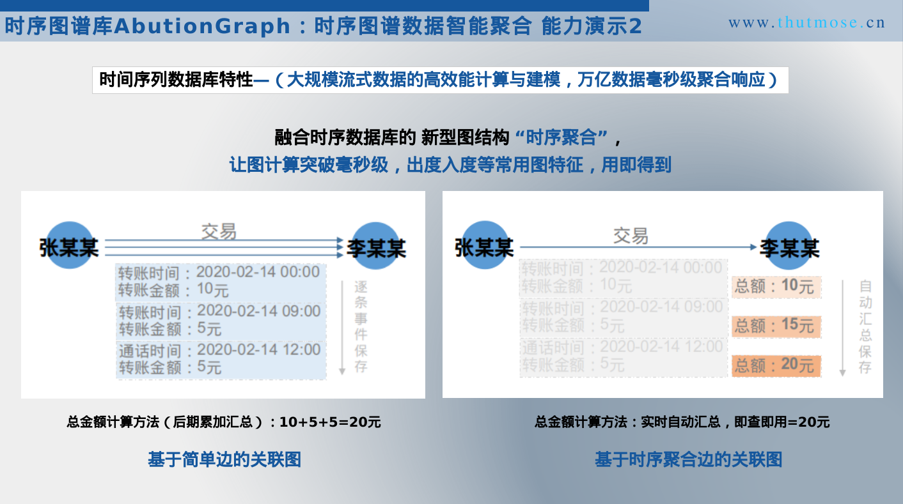
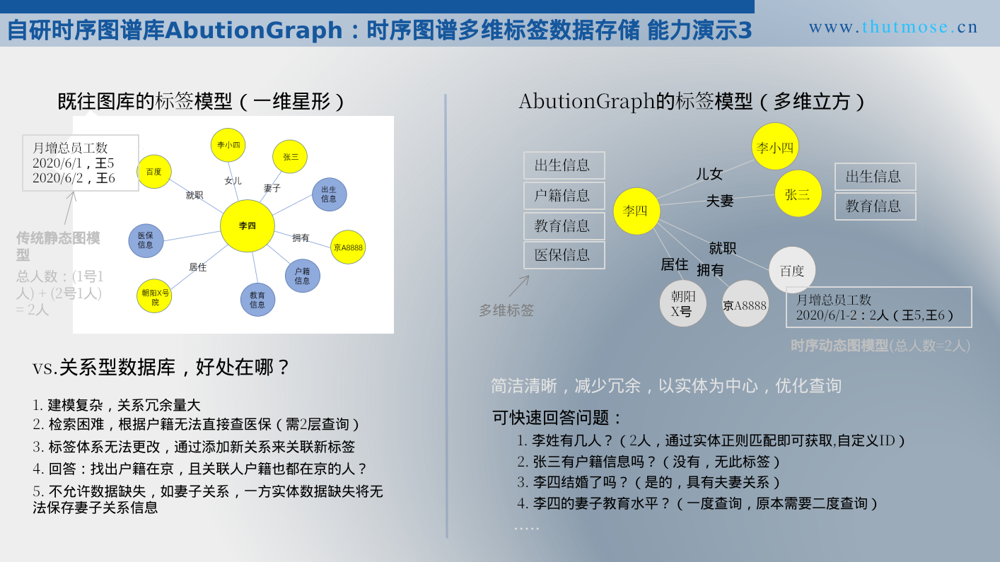
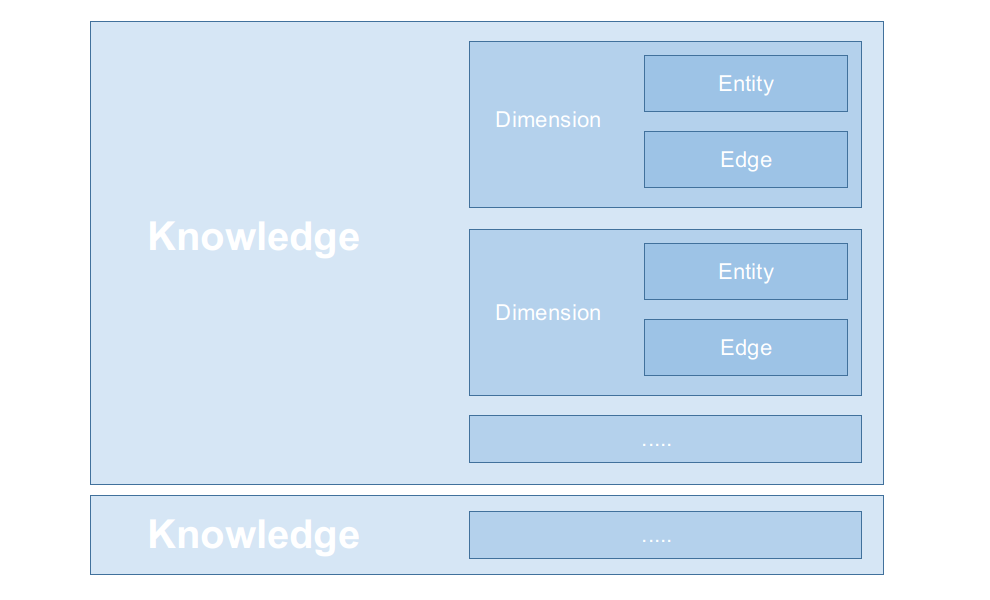

> 本章节介绍AbutionGraph的各个功能模块。特别提醒一下，AbutionGraph的静态模型支持新增和隐藏字段，通过更改Schema实现；动态模型支持空字段存储，并支持在后续需要的时候补全字段，通过聚合方法实现。

**AbutionGraph特有能力演示**  





### GraphInstance
GraphInstance是连接到一个AbutionGraph的操作，是执行查询语句的入口。相当于传统数据库连接，您可以使用g.*.exec(user)去执行一系列的图查询。  
- 图实例有3种使用方式：  
    1. Graph - 本地图实例连接，用于生产环境，只能在装有Abution的节点运行，可运行所有功能；  
    2. TmpGraph - 临时图实例连接，用于代码测试，无需部署Abution，数据即存即删，是一个临时内存图，算法功能不可用；  
    3. MemoryGraph- 分布式缓存图实例连接，该阶段还是实验性的，未经大规模项目验证；  
    4. RemoteGraph - 远程图实例连接，用于远程代码调试，IDEA中提交代码至服务器运行，UDF能力请使用Graph实例运行。  

#### 1）Graph实例

```java
Graph graph = G.Graph("graphId")
        .schema(schema)
        .build();

g.addOrUpdate(); //保存元数据

Graph graph = G.GetGraph("graphId"); //从已有图谱中快速初始化图实例
```

注意：  
graphId、schema是必须提交的参数。  
addOrUpdate为更新和保存元数据。  

#### 2）TmpGraph实例
TmpGraph实例采用java缓存保存数据，并不会持久化数据，当程序运行结束，数据将在内存中被清空，占用内存也随之释放。此实例本意是方便开发调试，并不适用于大规模数据。

```java
  Graph graph = G.TmpGraph(schema);
```

Ps：临时初始化实例无需数据库配置参数，只需schema定义，不走数据库，只使用缓存，程序停止数据即清空。因为是临时图存储，复杂的生产场景一般不用，所以一些算法功能没有单独开发出来。

#### 3）MemoryGraph实例
MemoryGraph实例采用分布式缓存作为数据持久化层，开启集群后将使用联邦集群的可用内存作为图数据存储，您可以在集群本地运行测试程序，也可以通过ip端口远程验证您的逻辑代码。当您关闭AbutionGraph集群后，数据将在内存中被清空，占用内存也随之释放。  

3个必填参数（图谱名称、Schema、远程服务器端口）
```java
Graph g = G.MemoryGraph("tgMemory1", schema, "127.0.0.1:5701");
// 保存元数据，以便可视化实时可见
g.addOrUpdate();
```

#### 4）远程/跨集群连接图实例
此功能允许在任何网络连通的机器使用AbutionGDB中的数据，无需在开发者本地部署AbutionGraph，前提是已开启AbutionGRS数据中台服务，你可以直接在IDEA中编写代码，读取本地数据，使用远程服务器运行你的代码，返回的结果数据就像是本地的Java对象一样。  
```java
Graph graph = G.GraphProxy.Builder()
        //.graphId("testGraph")  //可选参数,不填写则做多图知识融合查询
        .host("thutmose-aliyun") //改成数据库服务器ip
        .port(9090)
        .contextRoot("rest")
        .build();
```
GraphProxy在数据整合、数据迁移和项目开发调试阶段非常有用，如在IDEA中即可连接到云端服务并调试，它使大数据工程师的本地代码得以在云端运行，我们在未来的版本中会不断升级它，使图数据库更具有云服务的特性。
注意：此功能为定制化业务平台专用，为方便代码调试，GraphProxy仅实现了Graph实例的部分功能，算法功能不可用。

### Schema-图谱结构
Schema是每个图的结构信息，包含Entity和Edge，每张图中可以只有其一。

Schema（Entity&Edge）数据建模  
- Entity实体建模必须具备以下条件：  
    dimension - 维度标签  
    vertex    - 节点标识，如标识该实体是个“人”。如果实体以卡号标识，那么可以vertex=“卡号”  
    properties  - 该维度下具有的属性，格式为：属性名、属性类型、聚合函数、验证函数...  
    groupBy  - （可选）标识是聚合维度，groupBy中可指定依据的Key字段，groupBy()为空时将进行全局数据聚合  
- Edge关系建模必须具备以下条件：  
    dimension - 维度标签  
    source     - 源点对应的vertex标识  
    target     - 终点对应的vertex标识  
    properties  - 该维度下具有的属性，格式为：属性名、属性类型、聚合函数、验证函数...  
    groupBy  - （可选）标识是聚合维度，groupBy中可指定依据的Key字段，groupBy()为空时将进行全局数据聚合  

原始交易数据样例：
```bash
cxkh,jymc,dfcxkh,dfjymc,jysj,jyje
110,ID_110,111,ID_111,2019-03-30 09:00:00,10.0
110,ID_110,117,ID_117,2019-04-01 09:00:00,1000000.0
111,ID_111,112,ID_112,2019-04-04 09:00:00,970000.0
.....
```

如下所示图谱建模，我们基于资金交易数据构建了1个实体“卡”和1条关系“卡-卡”交易：  
1. “卡”实体拥有2个维度标签，分别是"Ka"和"Ka-AggDim"；  
2. “卡-卡”交易关系拥有2个维度标签，分别是"JiaoYi"和"JiaoYi-AggDayDim"；  
3. 实体与关系的2个维度标签，1个静态1个动态（使用groupBy区分）。  
```java
Schema schema = new Schema.Builder()
        .entity("卡",
                Dimension.label("Ka", "描述：每个卡号的交易名称")
                        .property("jymc", String.class)
                        .build(),
                Dimension.label("Ka-AggDim", "描述：每个交易卡号的聚合模型")
                        .property("peoples", TreeSet.class, Agg.CollectionConcat())
                        .property("peoplesCount", DistinctCountHll.class, Agg.DistinctCountHll())
                        .property("peoplesSum", Integer.class, Agg.Sum())
                        .groupBy()
                        .build()
        )
        .edge("卡","卡",
                Dimension.label("JiaoYi", "描述：交易历史记录")
                        .property("jysj",  Date.class)
                        .property("jyje",  BigDecimal.class)
                        .build(),
                Dimension.label("JiaoYi-AggDayDim", "描述：卡与卡之间的交易聚合明细")
                        .property("startTime",  Date.class, Agg.Min())
                        .property("stopTime",  Date.class, Agg.Max())
                        .property("sumMoney",  BigDecimal.class, Agg.Sum())
                        .groupBy("startTime","stopTime")
                        .build())
        .build();
```

**静态和动态数据的区别**  
静态维度：历史数据存储，支持常见的普通数据类型。  
动态维度：我们叫预聚合，即实时数据聚合存储，需指定每个property的Agg方式，及groupBy-keys。支持所有数据类型。  
动态聚合的数据形式存储是Abution中的特色，它将以groupByKey作为聚合轴，具有相同轴的所有属性值都将聚合为新的一条实体或关系存储在Abution中。  

### User-用户权限系统
AbutionGraph是一个高安全级别的数据库，每一个操作都可以定制权限许可，具有权限的用户才可以执行操作。AbutionUser是图级别的用户隔离，您可以使用AbutionGraphLibrary类管理这些用户及图的元数据信息，您也可以轻松与LDAP等外部用户库联动。它很简单，指定一个用户名就可以实现它。  
```java
User user = new User("用户名");
```
如不需要此功能，用户名留空即可。  

### AbutionGraph数据类型


***除了上面介绍的基本动态类型外（还有Geoshape地理空间类型），AbutionGraph还具有很多高级的性能卓越的高级动态类型，并且这些类型都支持跨机器的上卷聚合，如下：***

- **1）近似高基数估计-DistinctCountHllp**  
DistinctCountHllp是Google引入的一种最新算法，它基于HLL的DV估计功能，可使用恒定空间进行有效的基数和交点估计，并提高了准确性和可伸缩性。HLLP不仅适用于非常大的数据集（认为是万亿），而且适用于较小的基数集。
可包含列类型INT/LONG/FLOAT/DOUBLE/STRING，AbutionGraph会将offer中的每个值视为要添加到DistinctCountHllp对象中的单个条目，然后通过调用方法cardinality()来获得近似值。如下：
```java
    DistinctCountHllp hllp1 = new DistinctCountHllp();
    hllp1.update("aa");
    hllp1.update("aa");
    DistinctCountHllp hllp2 = new DistinctCountHllp();
    hllp2.update("bb");
    hllp2.update("cc");

    System.out.println(hllp1.cardinality()); // 结果为：1
    System.out.println(hllp2.cardinality()); // 结果为：2
```
作为AbutionGrpah中的一个实体属性存储：
```java
public void testHllp() {
    // 数据建模如下：
    Schema schema = Schema.Builder()
            .entity(Dimension.label("dim")
                    .property("key", String.class, Agg.Last())
                    .property("count", Integer.class, Agg.Sum())
                    .property("hllp", DistinctCountHllp.class, Agg.DistinctCountHllp())
                    .groupBy("key")
                    .build())
            .build();

    Graph graph = G.TmpGraph("testHllp", schema);

    // 数据转换为Hllp对象
    DistinctCountHllp hllp1 = new DistinctCountHllp();
    hllp1.update("aa");
    hllp1.update("aa");
    DistinctCountHllp hllp2 = new DistinctCountHllp();
    hllp2.update("bb");
    hllp2.update("cc");

    // 第一次写入完成后, hllp的基数为：1（aa）
    Entity entity1 = Knowledge.dimV("dim")
            .vertex("entity_110")
            .property("key", "图特摩斯科技")  // groupByKey
            .property("count", 1)            // 每写入一次加1
            .property("hllp", hllp1)          // DistinctCountHllp
            .build();
    g.addKnow(entity1).exec();

    // 第二次写入完成后, hllp的基数为：3（aa,bb,cc）
    Entity entity2 = Knowledge.dimV("dim")
            .vertex("entity_110")
            .property("key", "图特摩斯科技")   // groupByKey
            .property("count", 1)          // 每写入一次加1
            .property("hllp", hllp2)          // DistinctCountHllp
            .build();
    g.addKnow(entity2).exec();

    // 查询导入结果
    Iterable<? extends Knowledge> knowledges = g.V().dims().exec();

    System.out.println(JsonSerialiser.serialise(knowledges));
}
```
在以上写入程序执行完成之后，因为key相同，两条数据将发生聚合为一条数据，所以hllp的基数更新为[aa,bb,cc] = 3。  
```java
[Entity[vertex=entity_110,dimension=dim,properties=Properties[count=<java.lang.Integer>2,hllp=<cn.thutmose.abution.g.types.cardinality.DistinctCountHllp>3,key=<java.lang.String>图特摩斯科技]]]  
```
由于HyperLogLog本身不支持序列化，所以它打印出来是一个bytes，我们可以通过调用的属性的cardinality()方法获得基数。  

- 2）**精准高基数统计-DistinctCountPlus**  
精准高基数统计，返回列中所有去重值以及准确计数。采用RoaringBitmap + HDFS + AbutionGRS + dsi:fastutil的实现，其中，RoaringBitmap实现字符索引的基数统计，HDFS实现全局字典的持久化和版本管理，AbutionGRS图数据中台的分布式缓存可以用来缓存全局字典，加速基数聚合，dsi:fastutil用于在内存中更新全局字典。

- 3）**交并集高基数统计-DistinctCountThetas**  
DistinctCountThetas是基于DataSketches ThetaSketch的实现，它用于实现基数的交集（Intersection）、并集（Union）、差集（ANotB），近似的计算非重复计数，最典型的用例是根据不同日期的预聚合结果进行同比计算。  

其他数据类型实例查看详细文档。

### Knowledge-图谱数据
  **Entity**      - 实体  
  **Edge**       - 关系  
  **Knowledge**  - Abution中的图数据统称，包含实体与关系  
  **Dimension**  - 维度/标签，它在单图中名称必须唯一，命名规范： [a-zA-Z0-9|_-]*  
  **EntityKey**   - 节点ID（vertex），用于查询时输入。 -- 本系统完全支持自定义ID  
  **EdgeKey**    - 边三元组（source,target,directed），用于查询时输入。  



AbutionGraph的数据存储结构：  
```java
Entity entity = Knowledge.dimV("实体维度标签")
        .vertex("张三")
        .property("p1","v1")
        .build();
Edge edge = Knowledge.dimE("关系维度标签")
        .edge("张三", "李四").isDirected()
        .property("name1", "zhangsan")
        .property("name2", "lisi")
        .build();
```
对于数据的写入，您可以使用graph实例单条写入，也可以把以上Knowledge放到一个集合批次写入。Abution将以以上示例的Entity和Edge图谱格式将数据存储在数据库中，查询时得到的数据也是如此。
注意：维度标签请使用（字母、数字、|、_、-）表示。  

。。。。（示例略）


### Aremlin API

#### Knowledge数据写入
AbutionGraph的数据接入功能，可单条或者批量添加。通用的数据源接口，可从任何数据源生成元素后添加到AbutionGraph。  
knowledge写入示例：  
```java
  // 定义的数据集合
  List<Knowledge> knowledges = Arrays.asList(
          Knowledge.dimV("entity-type-1")
                  .vertex("vertex-1")
                  .property("property-1", "property-1-value")
                  .build(),
          Knowledge.dimE("edge-type-2")
                  .edge("src-vertex-1", "dst-vertex-1", true)
                  .property("property-2", "property-2-value")
                  .build()
  );

  g.addKnow(knowledges).exec();
```

- AddKnowledgeFromKafka    
该操作针对实时性追求到毫秒级的数据入库任务，我们整合了较新版本的消息流缓冲组件Kafka-2.2.x。老版本的Kafka我们也整合在了AbutionGDB中，文档在此不列出。
```java
g.dataSource().FlinkKafka()
        .parallelism(1)                                       // 并行度
        .topic("test")                                        //  (必填)Kafka Topic
        .groupId("group")                                     //  (必填)Kafka 消费组
        .bootstrapServers("www.thutmose.cn:9092")            // (必填)连接Kafka的ip:port
        .generator(TestGeneratorImpl.class)                   // (必填)数据处理逻辑程序
        .option(FlinkConstants.MAX_QUEUE_SIZE, "1000000")   // Flink数据缓冲区允许的最大条数-数据量大时用于暂存数据后批量入库
        .option(FlinkConstants.SKIP_REBALANCING, "true")    // 是否跳过在每次插入数据后做集群数据均衡分布
        .exec();
```
更多数据源请查看Gql文档。


#### Knowledge数据读取

- 例 - 获取指定实体且count小于2或大于5  
使用此有向图：  
```java
        --> 4 <--  
      /     ^     \
     /      |      \
    1  -->  2  -->  3  
             \
               -->  5  
```
```java
g.V(2).dim("entity").has("count").by(P.Or(P.LessThan(2),P.MoreThan(5))).exec();
```
得到相关结果，只有count<2，不存在count>5的实体：
>  Entity[vertex=2,dimension=entity,properties=Properties[count=<java.lang.Integer>1]]

- 例 - 获取节点2出方向且边属性count>2的邻居  
使用此有向图：  
```java
    --> 4 <--  
    /     ^     \
    /      |      \
    1  -->  2  -->  3  
         \
           -->  5  
```
```java
  g.V(2).OutE().dim("edgeDimensionLable")
          .has("count").by(P.MoreThan(2))
          .exec();
```
得到相关结果，2-(3)->3、2-(1)->4、2-(1)->5，只有2-(3)->3的边属性>1，节点名称：  
>  [vertex=3]

- 例 - 获取节点2出方向的二层邻居  
使用此有向图：  
```java
    --> 4 <--  
    /     ^     \
    /      |      \
    1  -->  2  -->  3  
         \
           -->  5  
```
```java
  g.V(2).Out().Out().exec();
```
结果：  
>  [vertex=4]

。。。 更多读取Gql请查看完整语法文档。


### Gremlin API
文档待完善。  

Gremlin API用法：
```java
  Graph g = G.GetGraph("graphId", new User());

  // gremlin查询图谱结构-查询示例
  Map<String, Object> variables = g.gremlinAPI().variables().asMap();
  System.out.println(variables);

  // gremlin原生语法支持-查询示例
  System.out.println( g.gremlinAPI().traversal().V('*').hasLabel("EntityDemension").count().emit() );
```

### GraphQL API
文档待完善。
