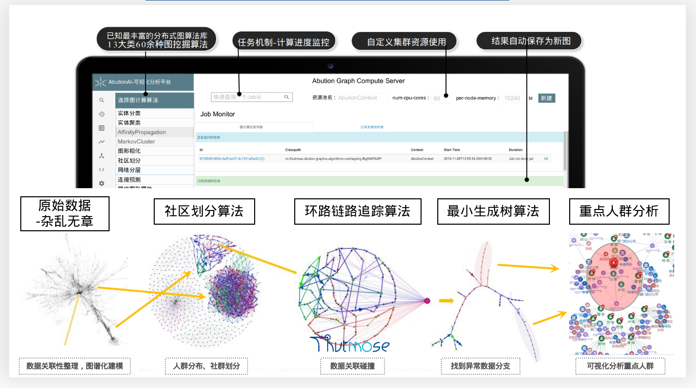
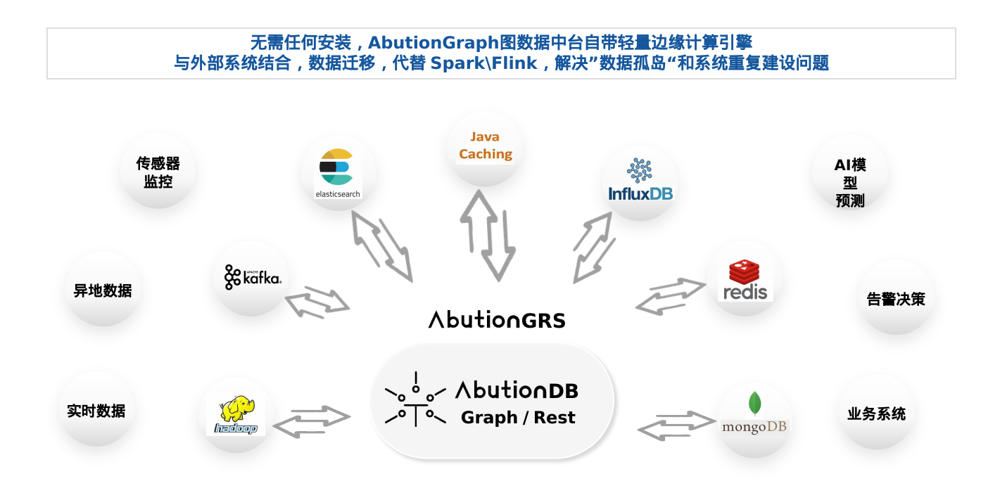

> 扩展能力需要相关专业的运维经验，如有需求请联系我们交流详细内容。

### 分布式图计算/图挖掘算法
AbutionGraph图挖掘平台包含13大类70种算法，计算与存储分离，运行在Spark上，算法可以个性化定制并扩增，且所有算法都可以进行二次开发，Abution可以无缝对接到GrapnFrames、GraphX、DataFrame、RDD上，并任由Spark工程师对图数据进行ELT操作，是完全对算法工程师开放的一个拿来即用的算法库。

* 需要算法二次开发可以与我们联系。

### Job-任务执行状态管理系统
对于每一个操作，AbutionGraph都可以记录下每个用户执行了什么写入和查询，对于大数据量的计算任务，还可以将任务放于后台运行，作为定时任务，执行完成后结果将保留于用户结果区，可随时根据JobId获取计算结果，增加用户体验度。


### 边缘计算/数字孪生
AbutionCache是一个分布式缓存框架和边缘计算框架，可作为Redis的替代品，将Java的一些原生对象变成分布式对象。同时可作为Flink/Spark常用功能的替代品，您不需要任何安装维护，附带在AbutionGraph安装包中了，执行启动命令即可。您也可以把计算能力独立出来，用于安装部署到小型内存的传感器中。


### Hive表格数据存储API
>（存储on Abution，计算on Spark）

Hive是一款于HDFS之上的数据库api，行式存储可用原生Hive存储，列式存储可用Abution，急速分析计算可配置使用Spark作为查询引擎。  
Hive是行式存储，检索效率底，但API很完善，拥有极大量的用户。Abution是列式存储，检索效率高，key-value的储存形式对于开发人员来说比较灵活，也意味着存储结构需要更深入的设计。而Hive-Abution-Storage则是将Abution用作Hive的数据存储，使用Hive的API来操作Abution，达到列式存储拥有表格存储的使用效果，并且达到列存的高效查询检索性能。

使用方式：
 * 使用带有Abution用户名密码参数的命令启动Hive REPL,（用户名和密码查看abution/conf/abution.propties）。

测试使用：
1. 启动Hive命令：
```sql
  hive -hiveconf abution.instance.name=AbutionGraph -hiveconf abution.zookeepers=localhost -hiveconf abution.user.name=root -hiveconf abution.user.pass=abutiongraph
```
2. 建表：
```sql
  CREATE TABLE abution_table(rowid STRING, name STRING, age INT, weight DOUBLE, height INT)
    STORED BY 'org.apache.hadoop.hive.abution.AbutionStorageHandler'
WITH SERDEPROPERTIES('abution.columns.mapping' = ':rowid, person:name, person:age, person:weight, person:height');
```
3. 插入数据：
```sql
  insert into table abution_table values('ADB', 'AbutionGrapn', 5, 1.0, 1);
```
4. 查询数据：
```sql
  select * from abution_table;
```
