> AbutionGraph旨在为需要关联数据实时分析的场景提供解决方案，即需要在超大数据量的图谱中立即返回统计分析结果，而不是像传统图数据库那样查询后等待漫长的计算过程，尽管这种实时响应计算分析的场景在每个项目中仅占2%-30%的需求，恰是这一部分需求会拖垮整个平台的使用体验。

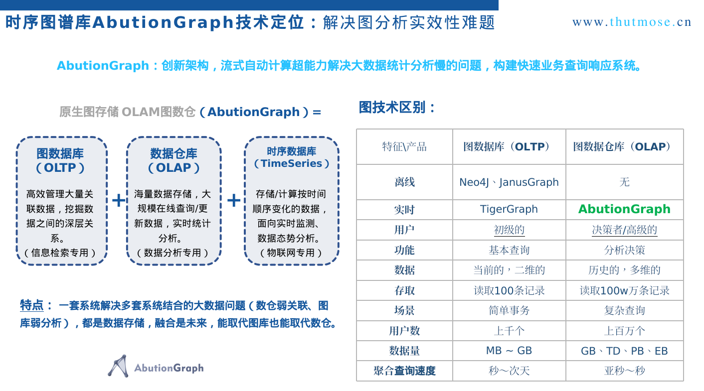

## 公安经济侦察
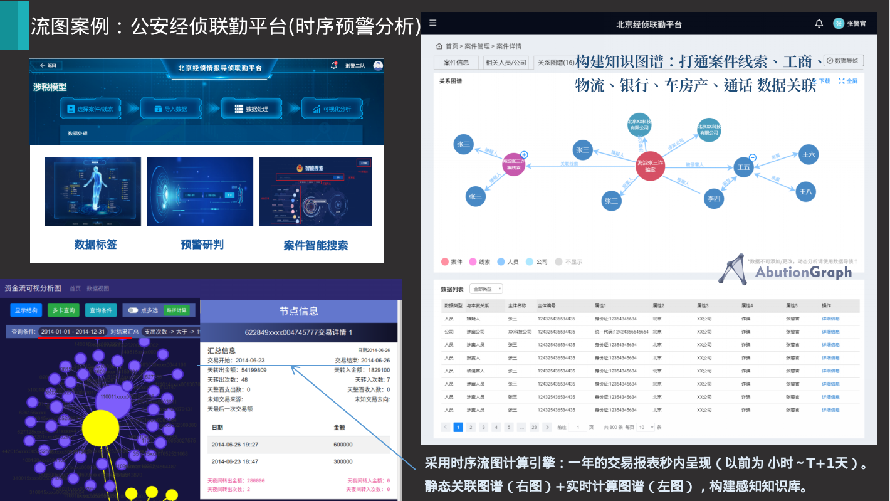

## 时序搜索引擎
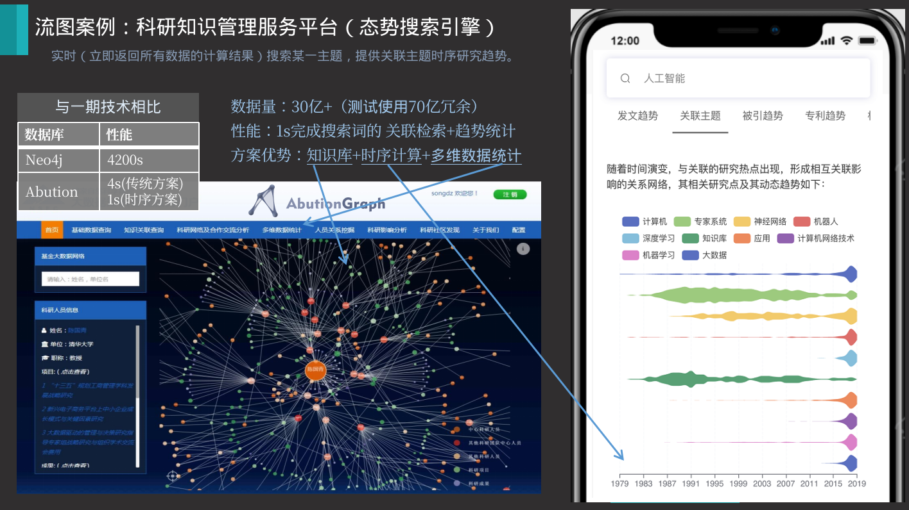

## 平安车险理赔风控
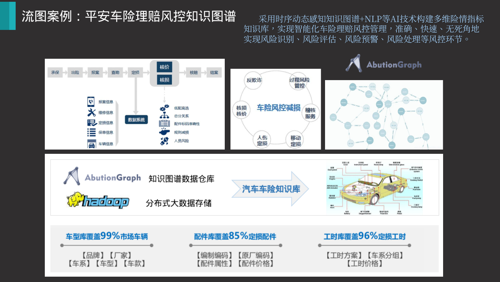

## 天然气感知分析
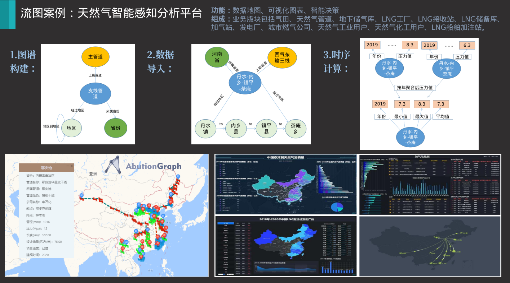

## 中国烟草科技图谱
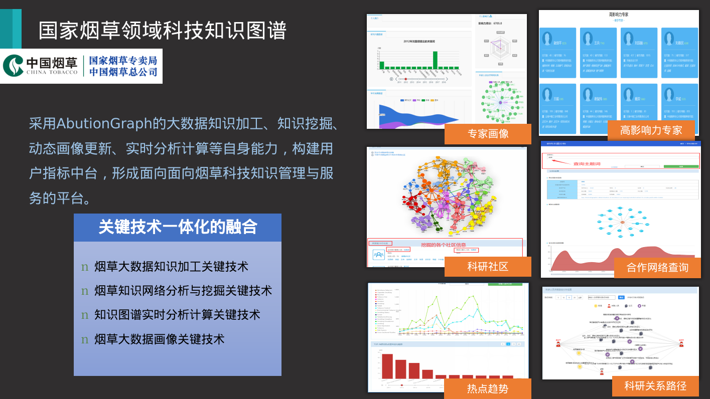

## 5G物联网设备诊断
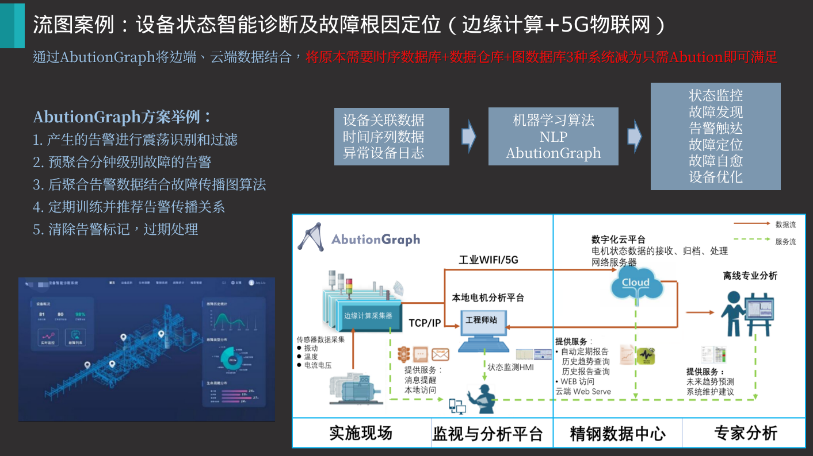

## 生物基因知识库
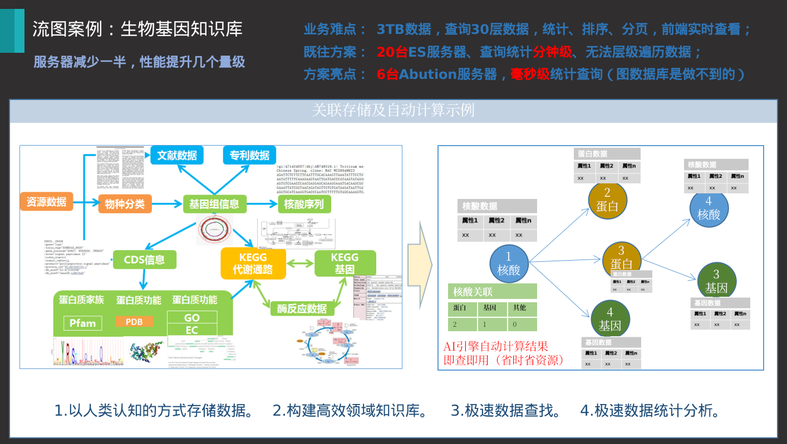

## 科协态势感知系统
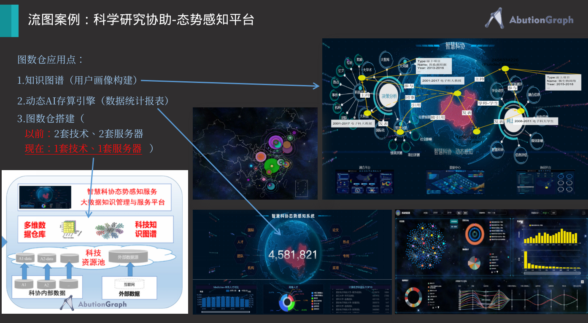

## 电信话单分析方案
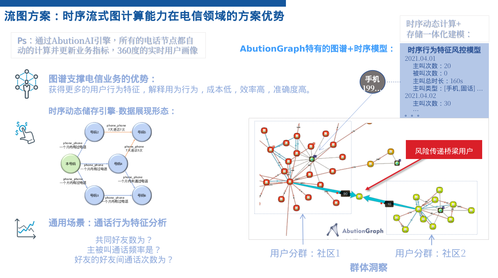

## AI特征工程指标计算
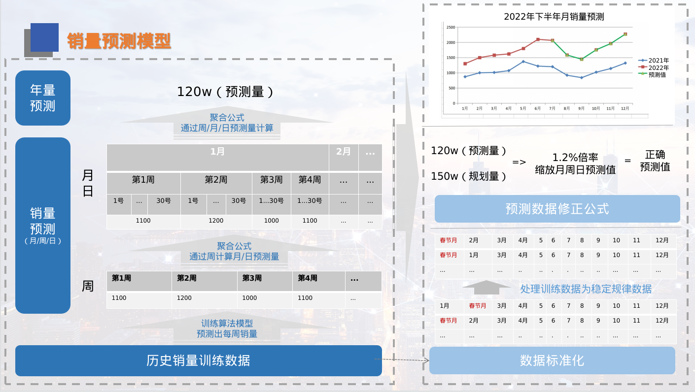

##

##

##

##

